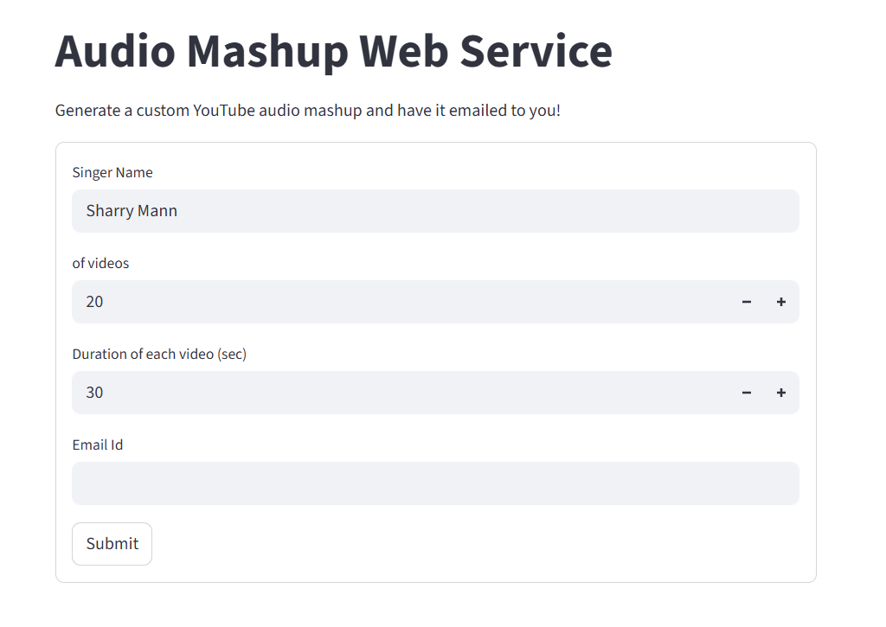

#  YouTube Audio Mashup Generator

## 1. Methodology

This project is developed to fulfill the Mashup Assignment requirements.  
It consists of two major components:

- Program 1: Command Line Python Script
- Program 2: Web-Based Mashup Service

The system uses the following technologies:

- `yt-dlp` – for downloading YouTube videos
- `pydub` – for trimming and merging audio
- `FFmpeg` – for audio processing support

### Workflow

1. **Search & Retrieval**
   - Searches YouTube using the singer’s name.
   - Downloads the top N videos.

2. **Audio Processing**
   - Converts downloaded videos into MP3 format.
   - Extracts the first Y seconds from each audio file.

3. **Concatenation**
   - Merges all trimmed audio clips into a single mashup file.

4. **Packaging & Delivery (Web Program)**
   - Compresses output into a `.zip` file.
   - Sends it to the user via email.

---

## 2. Project Description

This project is an automated tool that generates custom audio mashups from YouTube videos.

### Program 1 – `<RollNumber>.py`

A command-line tool that:

- Accepts input parameters
- Downloads YouTube videos
- Extracts and trims audio
- Merges audio files
- Generates final MP3 mashup

### Program 2 – `app.py`

A web application that:

- Provides a graphical interface
- Validates user inputs
- Generates mashup automatically
- Sends ZIP file to user's email

---

## 3. Input / Output

### Inputs

- Singer Name (String)
- Number of Videos (Integer > 10)
- Duration per Video (Seconds > 20)
- Email ID (Valid format – required for web service)

### Output

- A processed `.mp3` mashup file
- Delivered inside a `.zip` archive
- Sent to the provided email (Web Program)

---

## 4. Command Line Execution

Run the program as:

```bash
python <RollNumber>.py "<SingerName>" <NumberOfVideos> <AudioDuration> <OutputFileName>
```

### Example:

```bash
python 102313003.py "Diljit Dosanjh" 20 30 mashup.mp3
```

### Validations Performed

- Checks correct number of arguments
- Ensures number of videos > 10
- Ensures duration > 20 seconds
- Handles download and processing exceptions

---

## 5. Live Web Application

Live Link:  
https://sukhmanpreet123-mashup-assignment-app-wfo6y0.streamlit.app/

---

## 6. Screenshot of the Interface


<p align="center">
  
</p>


---

## 7. Technologies Used

- Python
- yt-dlp
- pydub
- FFmpeg
- Streamlit 


---


## 8. Error Handling

The system handles:

- Invalid arguments
- Invalid email format
- Network errors
- Download failures
- Missing FFmpeg configuration

---

## 9. Conclusion

The YouTube Audio Mashup Generator successfully automates:

- Video retrieval
- Audio extraction
- Audio trimming
- Audio merging
- Output delivery via email

The project satisfies all assignment requirements with proper validation and exception handling.
